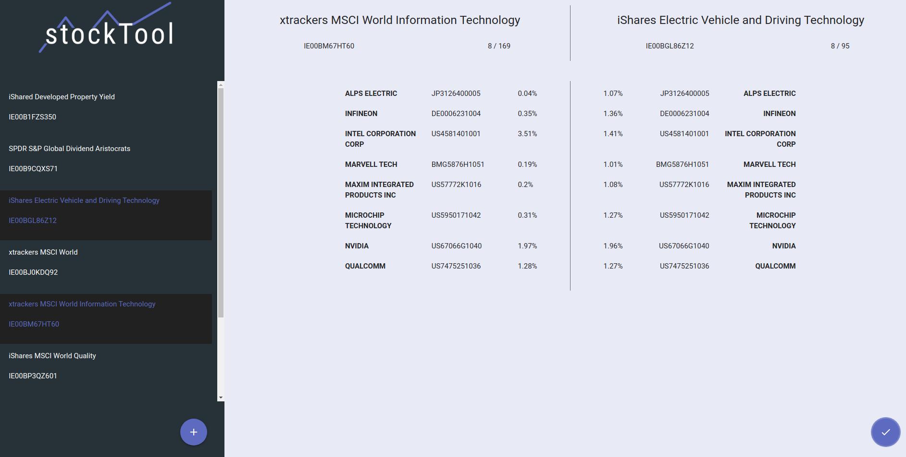
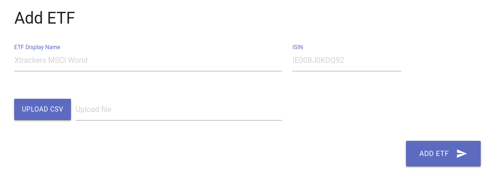

# stockTool

stockTool provides functionality to store ETF details via .csv Files and compare 
the various stocks contained in the ETFs with each other. It is possible to 
see which ETFs have which stocks in common, and how they are individually weighted. 

Installation
---
1. Install Docker and docker-compose for your individual operating system 
(see https://docs.docker.com/get-docker/).
2. Navigate in your preferred commandline (Powershell, CMD or Bash) to the 
location where the `docker-compose.yml` file is stored. 
(By default, this location is the projects root directory).
3. Start the tool by executing `docker-compose up --build`. This pulls the 
image for mariadb v10.5 and builds the stockTool image (Specified in `Dockerfile`).
Finally it starts both in containers and stockTool is available 
at `localhost:8080` via your internet browser. 
4. To terminate the tool, simply press `CTRL + C` in your commandline. All data 
from the database will be stored as volume, called `stocktool_db-data`. 
You can find it by executing `docker volume ls`, and delete it by 
`docker-compose down --volumes`

Usage
---
##### Load data into stockTool:

- **(Prerequisites)**: Prepare a valid .csv file which holds the stock details
of the ETF. Only **name**, **isin** and **weighting** must be stored in the .csv
file. **Please prepare the file in that way.** Usually the issuer of the ETF provides 
.xls or .xlsx files for downloading. You can open these files with Microsoft Excel,
Libre Office Calc, or a similar tool. Delete the arbitruary colums, so that only
**name**, **isin** and **weighting** are left. Export the values as .csv. An entry
in the .csv file shall look as following: `Nvidia,US67066G1040,3.3` or 
`Apple,US0378331005,8.7%`. Note that the percent sign (%) 
may be omitted. Two valid example .csv files can be found under `assets/csv`. 
Those can be used as reference or to test the stockTool.

- Click at the plus icon (+) at the bottom of the left section. A popup will
open, where you **must** specify a *name*, a *ISIN* and a .csv file which holds
the stock details. **The ETF details are usually available at the website of the 
issuer of the ETF**.

- A popup opens. Provide values for the **Name of the ETF** (this is solely for 
displaying, you may use a name that fits you), the **ISIN of the ETF** and a 
**valid .csv file**.
 

##### Compare two ETFs:

- Select two ETFs to compare, by clicking on their name in the left section.
They will be highlighted, if selected. When two ETFs are selected, the check
icon at the bottom right of the right section will be colored and start to pulse.
Click it, to compare the ETFs.

### I hope you have fun with stockTool and I wish you great success with investing! 

--> Feel free, to drop a message if you have questions or feature requests!

